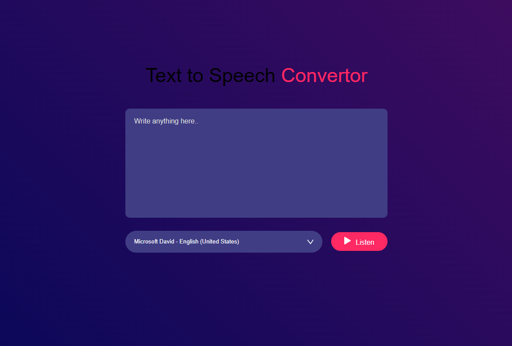

# Text to Speech Converter

This project is a simple web application that converts text input into audio output. It uses HTML, CSS, and JavaScript to achieve this functionality.

## Demo

[](https://itswasabi101.github.io/TextToSpeech/)

Click the image above to see a live demo of the project.

## Features

- Convert text to speech
- Adjustable speech rate and pitch
- Responsive design

## Usage

1. Clone the repository:
   ```bash
   git clone https://github.com/yourusername/text-to-speech.git
2. Execute the index.html website 

How it Works
The application uses the Web Speech API to synthesize speech from text input. The user can type or paste text into the input field, adjust the speech rate and pitch using the sliders, and then click the "Speak" button to hear the text spoken aloud.

 ```markdown
   
